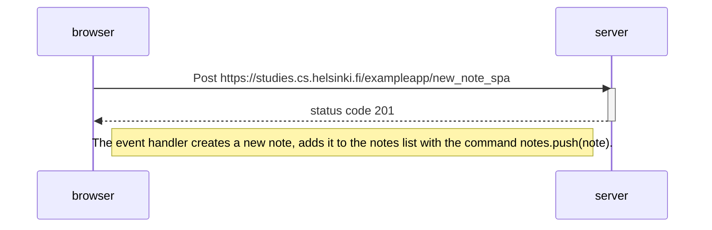

```mermaid
sequenceDiagram
    participant browser
    participant server

    browser->>server: Post https://studies.cs.helsinki.fi/exampleapp/new_note_spa
    activate server
    server-->>browser: status code 201
    deactivate server

    Note right of browser: The event handler creates a new note, adds it to the notes list with the command notes.push(note).

```